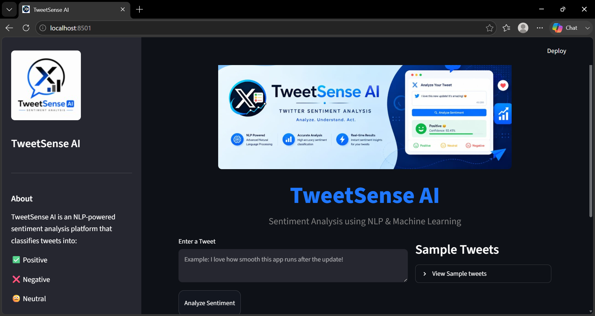
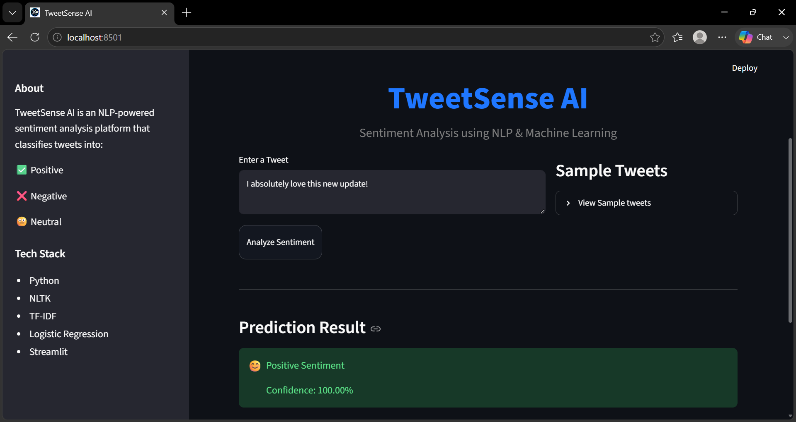
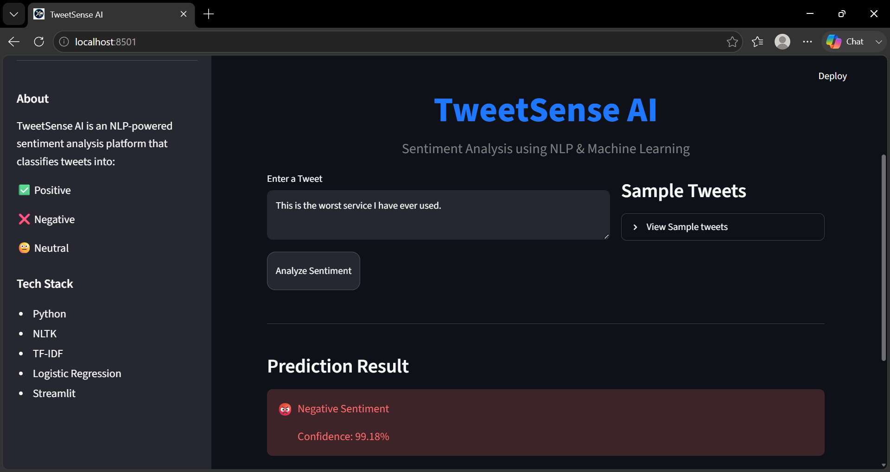
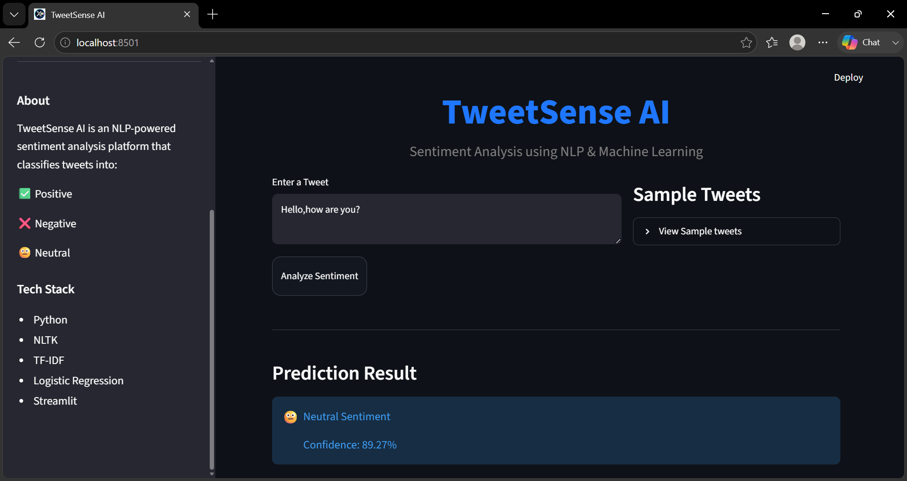

# TweetSense AI 

Twitter Sentiment Analysis using NLP and Machine Learning.

## Live Demo

👉 https://tweetsense-ai.onrender.com

---

## Overview

TweetSense AI is a web-based sentiment analysis application that classifies Twitter/X posts into:

- Positive
- Neutral
- Negative

The application uses Natural Language Processing (NLP) and Machine Learning to predict sentiment in real time.

---

## 🚀 Features

- Real-time sentiment prediction
- Positive, Neutral and Negative classification
- NLP preprocessing using NLTK
- TF-IDF feature extraction
- Logistic Regression classifier
- Interactive Streamlit UI
- Confidence score prediction
- Sample tweets for testing

---

## Tech Stack

- Python
- Streamlit
- NLTK
- Scikit-Learn
- Pandas
- NumPy
- Joblib

---

## Screenshots

### Home Page



---

### Positive Sentiment



---

### Negative Sentiment



---

### Neutral Sentiment



---

## Dataset

Dataset Source:

Twitter Sentiment Dataset from Kaggle

The dataset contains labeled tweets categorized into:

- Positive
- Neutral
- Negative

---

# Run Locally

### 1. Clone the repository

```bash
git clone https://github.com/YOUR_USERNAME/TweetSense-AI.git
```

### 2. Navigate to the project directory

```bash
cd TweetSense-AI
```

### 3. Install the required dependencies

```bash
pip install -r requirements.txt
```

### 4. Train the model

```bash
python train_model.py
```

This will create:

```text
model/
├── sentiment_model.pkl
└── vectorizer.pkl
```

### 5. Run the Streamlit application

```bash
streamlit run app.py
```

---

## Author

**Saravanan**

Artificial Intelligence & Machine Learning Student
